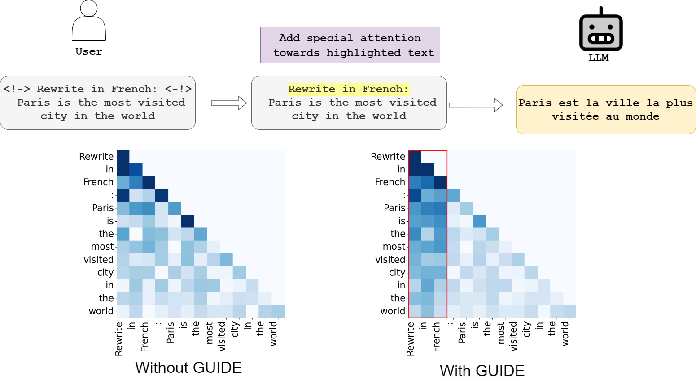
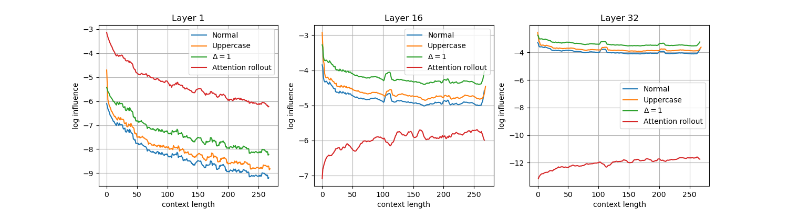

# Pay Attention Pipeline

This repository offers a pipeline to compute **Influence** and utilize **GUIDE** (**G**uided **U**nderstanding with **I**nstruction-**D**riven **E**nhancements) for improving transformer model explainability and performance. The pipeline adjusts attention mechanisms to prioritize specific instructions, offering a cost-effective alternative to traditional fine-tuning methods.

For more details, you can read our  [paper](https://arxiv.org/abs/2409.19001).

## Features

- **Generation with GUIDE**: Enhance model responses using tagged instructions for better context alignment.
- **Influence Calculation**: Measure the impact of specific subsequences on model predictions using attention scores.

## Motivation

Large Language Models (LLMs) often struggle with aligning outputs to user instructions, especially with longer contexts. Traditional solutions like fine-tuning are resource-intensive. GUIDE introduces a more efficient method by allowing users to emphasize important instructions within prompts, improving accuracy without additional training.

<p align="center">
  
</p>

## GUIDE

GUIDE allows users to highlight critical instructions in their input using tags `<!-> <-!>`. It modifies the attention weights to focus more on tagged text. For example:

```python
message = [{
  'role': 'user',
  'content': "<!-> Rewrite in French: <-!> Paris is the most visited city in the world."
}]
out = pipe(message, max_new_tokens=100)
```

This adjusts attention to focus more on the tagged instruction or text in general, enhancing the generation process. 

Three levels on enhancement are available `<!-> <-!>`, `<!!-> <-!!>` and `<!!!-> <-!!!>`, with increased level of attention to the enclosed text.

## Installation

Set up the environment with:

```bash
pip install pay-attention-pipeline
```

## Usage

You can use `PayAttentionPipeline` similarly to the standard Hugging Face pipeline:

1. **Load the Pipeline**:
   ```python
   from transformers import pipeline
   from pay_attention_pipeline import PayAttentionPipeline

   pipe = pipeline(
       "pay-attention",
       model="your_model_name",
   )
   ```

2. **Apply GUIDE**:
   Use tags like `<!-> <-!>` to guide the model:
   ```python
   message = [{'role': 'user', 'content': "<!-> Rewrite in French: <-!> Your text"}]
   out = pipe(message, max_new_tokens=100)
   ```
   On can use `<!!-> Rewrite in French: <-!!>` and `<!!!-> Rewrite in French: <-!!!>` to further increase the level of emphasis.
   
   
4. **Customize Delta Values** (Optional):
   Adjust `delta_mid` for different attention biases:
   ```python
   pipe = pipeline("pay-attention", model=base_model, delta_mid=10)
   ```

## Influence

The *Influence* metric measures the significance of tagged subsequences in a given context. Wrap text with `<?-> <-?>` to compute it:

```python
out = pipe("<?-> Rewrite in French <-?>" + prompt, max_new_tokens=100)
influence = out['influence']
```

Use this to fine-tune the attention adjustments. An example of visualization is available [here](examples/influence.ipynb).



## Citation

If you use this work in research, please cite:

```latex
@misc{silva2024payattention,
  title={Pay attention to what matters},
  author={Silva, Pedro Luiz and Ayed, Fadhel and de Domenico, Antonio and Maatouk, Ali},
  year={2024},
}
```

## License

This project is licensed under the MIT License.

## Contributing

Contributions are welcome! Open an issue or submit a pull request for improvements.
